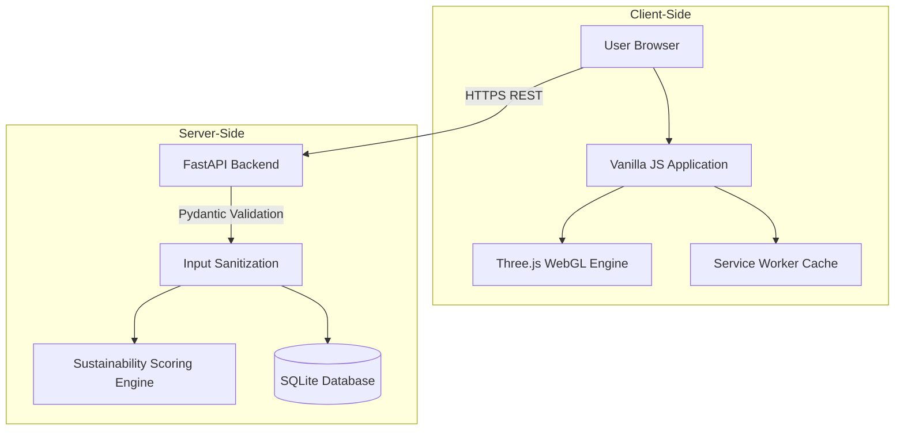

<div align="center">
  
  <h1>🌍 EcoTrace</h1>
  <p><b>Intelligent Carbon Footprint Analytics Platform</b></p>

  <p>
    <a href="https://eco-trace-218086876811.us-central1.run.app">
      
    </a>
  </p>

  <p>
    
    
    
    
  </p>

  <p>
    <a href="#-executive-summary">Overview</a> •
    <a href="#-technology-stack">Tech Stack</a> •
    <a href="#-architecture--engineering-decisions">Architecture</a> •
    <a href="#-production-readiness">Production Readiness</a> •
    <a href="#-local-setup">Setup</a>
  </p>
</div>

---

## 📖 Executive Summary

EcoTrace helps users understand, track, and reduce their carbon footprint through real-time analytics, sustainability recommendations, and gamified progress tracking.

| The Problem | The Solution | The Impact |
| :--- | :--- | :--- |
| Global carbon emissions are rising, yet individuals lack actionable, real-time tools to track and reduce their personal environmental footprint. | A dynamic web application combining real-time footprint calculation, heuristic sustainability coaching, and a gamified habit-building loop. | Empowers users with the data-driven insights necessary to quantifiably lower their personal carbon emissions through sustained behavioral changes. |

### 📊 Project Overview
- **Deployment Platform:** Google Cloud Run (Docker Containerized)
- **Frontend Architecture:** Vanilla JavaScript (ES Modules, WebGL)
- **Backend Architecture:** Python FastAPI, SQLite
- **Automated Testing:** 32 passing tests covering API functionality and end-to-end browser workflows.

## 🏅 Key Outcomes

✅ Interactive WebGL-based 3D Earth visualization

✅ Real-time carbon footprint tracking

✅ Gamified sustainability engagement system

✅ Fully containerized deployment on Google Cloud Run

✅ 32 automated tests passing

✅ Secure FastAPI backend with validation and CSP enforcement

## ⚙️ How It Works

1. Users enter transportation, energy, diet, and lifestyle data.
2. FastAPI processes inputs and calculates estimated carbon emissions.
3. The sustainability scoring engine evaluates user habits.
4. Interactive charts and analytics visualize footprint distribution.
5. Personalized recommendations and gamification features encourage sustainable behavior change.

---

## 💻 Technology Stack

| Layer | Technologies |
|---------|---------|
| **Frontend UI** | HTML5, CSS3, Vanilla JavaScript |
| **Visualization** | Chart.js, Three.js (WebGL) |
| **Backend API** | Python, FastAPI |
| **Validation** | Pydantic |
| **Database** | SQLite, SQLAlchemy |
| **Testing** | Pytest, Playwright |
| **Infrastructure** | Docker, Google Cloud Run |

---

## 🏗️ Architecture & Engineering Decisions

EcoTrace utilizes a decoupled client-server model, prioritizing performance, strict state management, and rapid iteration.



### Key Technical Choices
- **Vanilla JavaScript Frontend:** Chosen to eliminate framework overhead and reduce initial load times. Application state is managed via a strict unidirectional `setState` pattern that isolates DOM updates.
- **FastAPI Backend:** Selected for native asynchronous capabilities and strict type checking via Pydantic, which significantly simplifies data validation and prevents runtime errors.
- **WebGL Visualization:** Utilizes Three.js with procedurally generated textures to render an interactive 3D Earth. WebGL resources are explicitly cleaned up using disposal routines to reduce unnecessary memory usage and prevent browser lag.
- **Service Worker:** Implemented to cache static assets locally, mitigating network latency on subsequent visits.

---

## 🛡️ Production Readiness

EcoTrace is engineered to be secure, reliable, and production-ready from day one.

### Security Posture
- **Content Security Policy (CSP):** Strict headers enforced via FastAPI middleware to prevent unauthorized cross-origin execution.
- **XSS Protection:** Custom `escapeHTML` sanitizer ensures that all dynamic user inputs are safely escaped prior to DOM injection.
- **Data Validation:** Incoming REST API requests are strictly validated using Pydantic schemas.

### Testing & Quality Assurance
- **Backend Validation (Pytest):** Tests validate all FastAPI endpoints, scoring heuristics, and database CRUD operations.
- **End-to-End Validation (Playwright):** Browser automation verifies that critical user flows function properly in a Chromium environment.
- **Status:** All 32 automated tests are currently passing.

### Infrastructure & Deployment
Docker containerization ensures environment consistency between development and production. The application is deployed as a managed, stateless service on **Google Cloud Run**.

### Live Application

🔗 https://eco-trace-218086876811.us-central1.run.app

```bash
# Build the container image
gcloud builds submit --tag us-central1-docker.pkg.dev/PROJECT_ID/eco-trace-repo/eco-trace-app:latest .

# Deploy the container
gcloud run deploy eco-trace \
  --image us-central1-docker.pkg.dev/PROJECT_ID/eco-trace-repo/eco-trace-app:latest \
  --region us-central1 \
  --platform managed \
  --allow-unauthenticated
```

---

## 📁 Repository Structure

```text
ecotrace/
├── main.py                 # FastAPI application and routing
├── models.py               # SQLAlchemy database models
├── schemas.py              # Pydantic validation schemas
├── calculations.py         # Deterministic emission calculation logic
├── scoring.py              # Heuristic evaluation engine
├── tests/                  # Pytest and Playwright test suite
├── Dockerfile              # Containerization configuration
└── static/                 # Frontend assets
    ├── app.js              # State management and API integration
    ├── ui.js               # DOM manipulation
    ├── earth.js            # Procedural WebGL rendering
    ├── charts.js           # Chart.js integration
    └── sw.js               # Service Worker
```

---

## 💻 Local Setup

```bash
# 1. Clone the repository
git clone https://github.com/tanush326k/carbontrack.git
cd carbontrack

# 2. Create and activate a virtual environment
python -m venv venv
source venv/bin/activate  # Windows: venv\Scripts\activate

# 3. Install dependencies
pip install -r requirements.txt

# 4. Start the development server
uvicorn main:app --reload
```
Navigate to `http://localhost:8000` to view the application.

---

## 🌍 Project Vision

EcoTrace was built to make sustainability measurable, understandable, and actionable. By combining carbon footprint analytics, behavioral recommendations, and engaging visual experiences, the platform encourages long-term environmental awareness and positive habit formation.

---

## 🗺️ Roadmap

- [ ] **Mobile App:** Port functionality to a cross-platform framework.
- [ ] **API Integrations:** Sync data directly from smart home devices (e.g., thermostats) and EV dashboards.
- [ ] **Corporate Challenges:** Implement localized organizational goals.

---

## 🤝 Contributing

1. Fork the Project
2. Create your Feature Branch (`git checkout -b feature/NewFeature`)
3. Commit your Changes (`git commit -m 'Add new feature'`)
4. Push to the Branch (`git push origin feature/NewFeature`)
5. Open a Pull Request

---

## 📄 License

Distributed under the MIT License. See `LICENSE` for more information.
