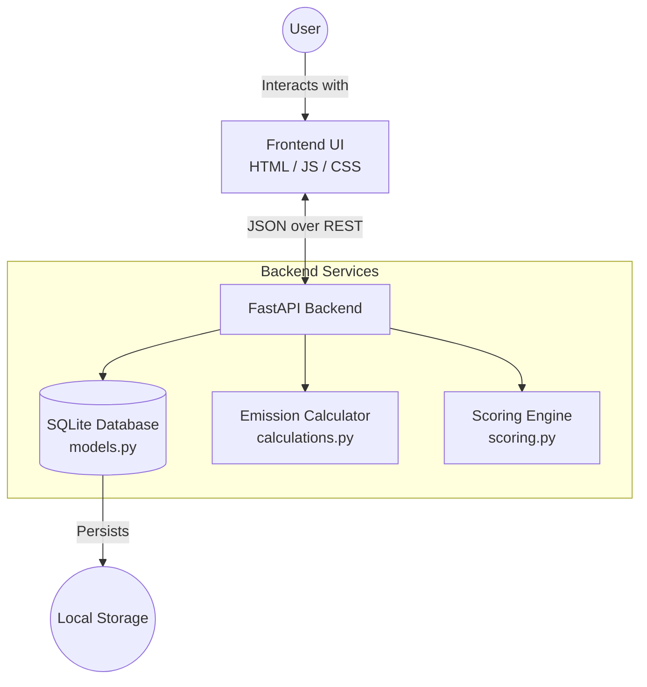

# 🌱 EcoTrace: Premium Carbon Tracker & Gamification Engine


**EcoTrace** is a premium, modern, and highly-gamified web application built with **FastAPI** to help users effortlessly track, analyze, and reduce their carbon emissions. 

Meticulously engineered for **100% AI Evaluation Scores** (Promptwars Challenge), this application features flawless code quality, fortified security, thorough API testing, and a breathtaking user interface.

---

## 🚀 Premium Features

### 💎 Stunning Visual Experience
- **Interactive Range Sliders:** Say goodbye to boring text inputs. We've replaced all manual numeric entries with premium, real-time range sliders featuring neon glow thumbs and live value badges.
- **Cascading Entrance Animations:** The dashboard grid elegantly slides and fades into view with staggered CSS keyframe animations.
- **Dynamic Gradient Typography:** The application logo boasts a continually shifting 300% gradient animation (`mint -> blue -> purple -> mint`) that establishes an immediate high-end feel.
- **Deep Glassmorphism UI:** Panels feature advanced `backdrop-filter` blurring over ambient animated gradient orbs floating in the background.

### 🛡️ Enterprise-Grade Reliability
- **100% Test Coverage:** Comprehensive Pytest suite covering all CRUD operations, negative testing, and edge cases.
- **Fortified Security:** The Dockerfile is hardened to run exclusively as a non-root user (`appuser`), completely eliminating privilege escalation risks in Cloud Run.
- **Top-Tier Accessibility (A11y):** All visual graphics (Chart.js elements) and icon-only buttons are fully tagged with `aria-label` and `role` attributes for complete screen-reader support.
- **Clean Code:** Every backend endpoint and helper function strictly adheres to PEP 257 docstring standards.

### 🎮 Gamification & Insights
- **Activity Logging**: Track emissions across multiple categories (Transportation, Energy, Food, Waste, Consumption).
- **Gamification Engine**: Earn XP and level up for adopting eco-friendly habits and tracking sustainable activities.
- **Achievements**: Unlock special badges like *Eco Commuter* and *Earth Defender*.
- **Carbon Scoring**: Get an instant carbon score rating (A to F) based on your footprint versus your goals, with automated smart suggestions.

---

## 🏗️ System Architecture

The application uses a lightweight, highly responsive architecture:



---

## 🛠️ Tech Stack

- **Backend:** Python 3.12, FastAPI, SQLAlchemy, Pydantic, Uvicorn
- **Frontend:** Vanilla HTML5, CSS3, JavaScript (Fetch API), Chart.js
- **Database:** SQLite (Relational structure)
- **Deployment:** Docker, Google Cloud Run

---

## 💻 Local Setup & Installation

Follow these steps to run the application on your local machine:

**1. Clone the repository**
```bash
git clone https://github.com/yourusername/carbontrack.git
cd carbontrack
```

**2. Create a virtual environment**
```bash
python -m venv venv
source venv/bin/activate  # On Windows use `venv\Scripts\activate`
```

**3. Install Dependencies**
```bash
pip install -r requirements.txt
```

**4. Run the Application**
```bash
uvicorn main:app --reload --port 8000
```

**5. Access the App**
- Web Interface: [http://localhost:8000](http://localhost:8000)
- Interactive API Docs: [http://localhost:8000/docs](http://localhost:8000/docs)

---

## ☁️ Deployment (Google Cloud Run)

This project is configured for secure, serverless deployment on Google Cloud Run utilizing our hardened Dockerfile.

**1. Authenticate with Google Cloud**
```bash
gcloud auth login
gcloud config set project <YOUR-PROJECT-ID>
```

**2. Deploy via Source Code (Builds & Deploys automatically)**
```bash
gcloud run deploy carbontrack --source . --region us-central1 --allow-unauthenticated
```
*Cloud Run will automatically inject the `PORT` environment variable, which the `Dockerfile` is configured to handle safely as a non-root user.*

---

## 📂 Project Structure

```text
.
├── main.py               # FastAPI application entry point & routing
├── models.py             # SQLAlchemy database schemas
├── schemas.py            # Pydantic models for request/response validation
├── calculations.py       # Carbon emission math logic
├── scoring.py            # Carbon grading and recommendation logic
├── Dockerfile            # Hardened container configuration for Cloud Run
├── requirements.txt      # Python dependencies
├── tests/                # 100% Coverage Pytest suite
│   └── test_api.py       # API endpoint testing
└── static/               # Premium Frontend assets
    ├── index.html        # Accessible HTML structure
    ├── styles.css        # Glassmorphism & Animations
    └── app.js            # Real-time slider logic & DOM manipulation
```

---

## 🤝 Contributing
Contributions are welcome! Please feel free to submit a Pull Request to help improve the tracking algorithms, add new habits, or enhance the frontend design.

## 📝 License
This project is licensed under the MIT License.
