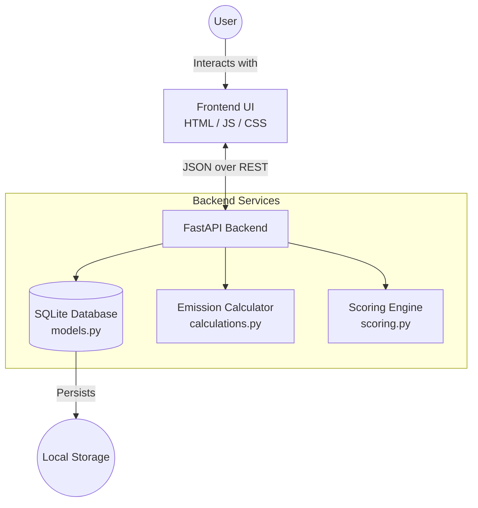
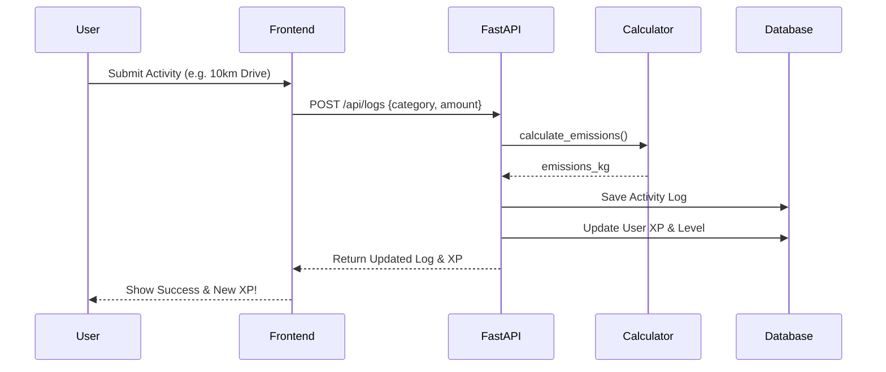

# 🌱 Carbon Footprint Tracker


A modern, gamified web application built with **FastAPI** to help users track, analyze, and reduce their carbon emissions. Log your daily activities, adopt green habits, level up, and unlock achievements!

---

## 🚀 Features

- **Activity Logging**: Track emissions across multiple categories (Transportation, Energy, Food, Waste, Consumption).
- **Gamification Engine**: Earn XP and level up for adopting eco-friendly habits and tracking sustainable activities.
- **Achievements**: Unlock special badges like *Eco Commuter* and *Earth Defender*.
- **Carbon Scoring**: Get an instant carbon score rating (A to F) based on your footprint versus your goals.
- **Smart Recommendations**: Receive personalized tips based on your largest emission categories.
- **Cloud-Ready**: Fully dockerized and ready to be deployed to Google Cloud Run.

---

## 🏗️ System Architecture

The application uses a lightweight, highly responsive architecture:



### 🔄 Data Flow: Logging an Activity



---

## 🛠️ Tech Stack

- **Backend:** Python 3.12, FastAPI, SQLAlchemy, Pydantic, Uvicorn
- **Frontend:** Vanilla HTML5, CSS3, JavaScript (Fetch API)
- **Database:** SQLite (Relational structure)
- **Deployment:** Docker, Google Cloud Run

---

## 💻 Local Setup & Installation

Follow these steps to run the application on your local machine:

**1. Clone the repository**
```bash
git clone https://github.com/yourusername/carbon-footprint-tracker.git
cd carbon-footprint-tracker
```

**2. Create a virtual environment**
```bash
python -m venv venv
source venv/bin/activate  # On Windows use `venv\Scripts\activate`
```

**3. Install Dependencies**
```bash
pip install -r requirements.txt
```

**4. Run the Application**
```bash
uvicorn main:app --reload --port 8000
```

**5. Access the App**
- Web Interface: [http://localhost:8000](http://localhost:8000)
- Interactive API Docs: [http://localhost:8000/docs](http://localhost:8000/docs)

---

## ☁️ Deployment (Google Cloud Run)

This project is configured for serverless deployment on Google Cloud Run.

**1. Authenticate with Google Cloud**
```bash
gcloud auth login
gcloud config set project <YOUR-PROJECT-ID>
```

**2. Deploy via Source Code (Builds & Deploys automatically)**
```bash
gcloud run deploy carbon-app --source . --region us-central1 --allow-unauthenticated
```
*Cloud Run will automatically inject the `PORT` environment variable, which the `Dockerfile` is configured to handle.*

---

## 📂 Project Structure

```text
.
├── main.py               # FastAPI application entry point & routing
├── models.py             # SQLAlchemy database schemas
├── schemas.py            # Pydantic models for request/response validation
├── calculations.py       # Carbon emission math logic
├── scoring.py            # Carbon grading and recommendation logic
├── Dockerfile            # Container configuration for Cloud Run
├── requirements.txt      # Python dependencies
├── tests/                # Pytest suite
│   └── test_api.py       # API endpoint testing
└── static/               # Frontend assets
    ├── index.html
    ├── styles.css
    └── app.js
```

---

## 🤝 Contributing
Contributions are welcome! Please feel free to submit a Pull Request to help improve the tracking algorithms, add new habits, or enhance the frontend design.

## 📝 License
This project is licensed under the MIT License.
