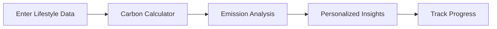
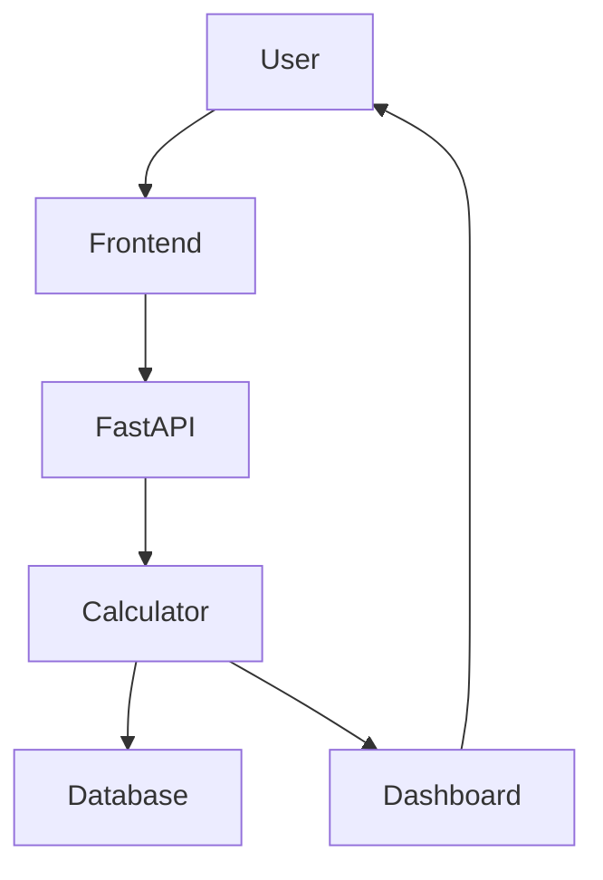

````markdown
<div align="center">


# 🌍 EcoTrace

### Intelligent Carbon Footprint Analytics Platform

Measure • Understand • Reduce • Improve

[](https://carbontrack-qsm9.onrender.com/)


**🌐 Live Application:** https://carbontrack-qsm9.onrender.com/

</div>

---

# 🌱 About

EcoTrace is a lightweight sustainability platform that helps users estimate their carbon footprint based on everyday activities. It combines interactive visualizations, intelligent recommendations, and progress tracking to encourage environmentally conscious habits.

---

# ✨ Features

- 🌍 Carbon Footprint Calculator
- 📊 Interactive Analytics Dashboard
- 🌎 3D Earth Visualization
- 💡 Personalized Sustainability Tips
- 🏆 Gamified Achievements
- 📈 Progress Tracking
- ⚡ Fast & Responsive Interface

---

# 🔄 How It Works



---

# 🏗 System Architecture



---

# 💻 Tech Stack

| Layer | Technology |
|--------|------------|
| Frontend | HTML5 • CSS3 • JavaScript |
| Backend | FastAPI |
| Database | SQLite |
| Visualization | Three.js • Chart.js |
| Testing | Pytest • Playwright |
| Hosting | Render |

---

# 📂 Project Structure

```text
carbontrack/

├── main.py
├── calculations.py
├── models.py
├── scoring.py
├── schemas.py
├── static/
├── tests/
├── assets/
└── README.md
```

---

# 🚀 Run Locally

```bash
git clone https://github.com/tanush326k/carbontrack.git

cd carbontrack

pip install -r requirements.txt

uvicorn main:app --reload
```

Open:

**http://localhost:8000**

---

# 📊 Project Goals

- Encourage sustainable living
- Visualize carbon emissions
- Promote eco-friendly habits
- Make climate awareness engaging
- Provide actionable recommendations

---

# 🛣 Future Improvements

- 🌐 Multi-language support
- 📱 Mobile-friendly enhancements
- 🔔 Daily sustainability reminders
- 📤 Export reports
- ☁ Cloud data synchronization

---

# 🤝 Contributing

Contributions are welcome!

1. Fork the repository
2. Create your feature branch
3. Commit your changes
4. Submit a Pull Request

---

# 📄 License

Distributed under the **MIT License**.

See the **LICENSE** file for more information.

---

<div align="center">

### 🌎 Small Actions. Big Impact.

**⭐ If you like EcoTrace, consider giving the repository a star!**

Made with 💚 for a more sustainable future.

</div>
````
